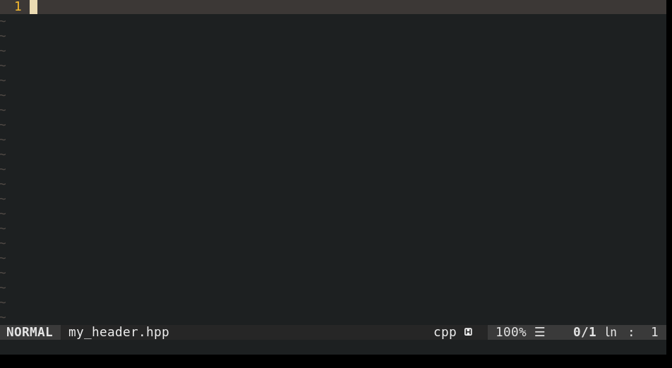

# Vim-Protect-Header
A simple vim plugin to quickly protect c/c++ header files

Example: \


## Installation

### Using Plug
```
Plug 'Yohannfra/Vim-Protect-Header'
```

### Manual installation
```
git clone https://github.com/Yohannfra/Vim-Protect-Header/ ~/.vim/plugin/
```

## Configuration

You can call the function automatically when creating a .h/.hpp file.\
insert this line in your .vimrc
```vim
autocmd BufNewFile *.h,*.hpp :Protect
```

## How to use

```
:Protect
```

## License

This project is licensed under the terms of the MIT license.
